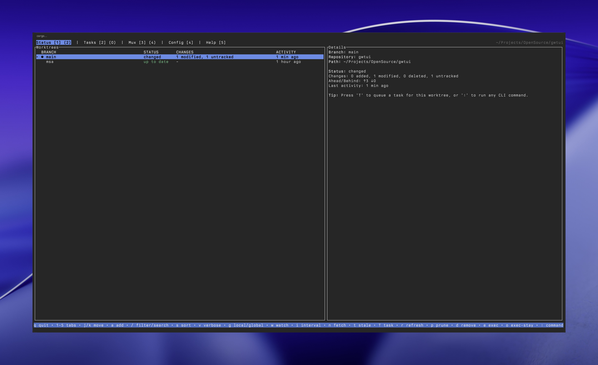

# gwtui



Production-grade Rust + Ratatui reimplementation inspired by `gwq` (worktrees + status + tasks), with **CLI compatibility** and a modern mux backend (**Zellij**).

Key points:

- Binary: `gwtui`
- Rust edition: 2024, no `unsafe`
- Shells out to `git` (git is the source of truth)
- Interactive UI only when stdout is a TTY
- `gwtui tmux ...` is a **compatibility alias** that routes to Zellij

## Install / Build

From the repo:

```bash
cargo build --release
./target/release/gwtui --help
```

Running with no arguments opens the main TUI on a TTY (and prints a single status table in non-TTY contexts):

```bash
gwtui
```

## Quickstart

All examples below assume `gwtui` is on your `PATH`. If you just built from source, use `./target/release/gwtui` instead.

### TUI (interactive)

Open the main multi-tab UI:

```bash
gwtui
```

Useful first keys:

- `a` add a worktree (interactive)
- `/` filter/search
- `:` command palette (run any `gwtui` CLI subcommand)
- `q` quit

### CLI (common workflows)

Create a new worktree for a new feature branch (from inside a git repo):

```bash
gwtui add -b feature/auth
```

List worktrees (local to the current repo, or global from `worktree.base_dir`):

```bash
gwtui list
gwtui list -g
```

Jump into a worktree directory:

```bash
cd "$(gwtui get feature/auth)"
```

Watch status in an interactive dashboard:

```bash
gwtui status --watch
gwtui status -g --watch
```

Run a command inside a worktree (note the required `--` separator):

```bash
gwtui exec feature/auth -- cargo test
gwtui exec -g feature/auth -- cargo test
```

### Zellij / tmux (mux backend)

From inside a Zellij session (or with exactly one active session):

```bash
gwtui zellij list
gwtui zellij run -w feature/auth -- cargo test
gwtui zellij attach -i
```

## CLI (gwq-compatible)

Commands:

- `gwtui add [-b] [-i] [-f] <branch> [path]`
- `gwtui list [-v] [--json] [-g]`
- `gwtui get [-g] [-0] [pattern]`
- `gwtui exec [gwq-compatible flags...] -- <cmd...>`
- `gwtui remove|rm [-f] [-d] [-g] [-b] [--force-delete-branch] [pattern]`
- `gwtui status [-g] [-v] [--json|--csv] [--watch] [--filter ...] [--sort ...]`
- `gwtui prune`
- `gwtui config list|set|get`
- `gwtui completion <shell>`
- `gwtui tmux list|run|attach|kill` (routes to Zellij)
- `gwtui zellij list|run|attach|kill` (same as `tmux`)
- `gwtui task add|list|show|logs|worker`
- `gwtui version` / global `--version`

## Configuration (TOML)

Config file:

- macOS/Linux: `~/.config/gwtui/config.toml`
- Windows: platform config dir (also honors the Unix path if present)

Resolved config:

```bash
gwtui config list
```

Set values (dot-path keys):

```bash
gwtui config set worktree.base_dir "~/worktrees"
gwtui config set ui.icons true
gwtui config set mux.backend zellij   # or: none
gwtui config set tmux.enabled false   # gwq-compat alias → mux.backend=none
gwtui config set worktree.sanitize./ "-"
```

Schema (defaults shown):

```toml
[worktree]
base_dir = "~/worktrees"
auto_mkdir = true
naming_template = "{{host}}/{{owner}}/{{repo}}/{{branch}}"
sanitize = { "/" = "-", ":" = "-", " " = "-" }

[discovery]
mode = "auto" # auto | local | global
global_scan_depth = 6
cache_ttl_seconds = 3
dedupe_by_main_repo = true

[ui]
icons = true
tilde_home = true
picker_preview = true
picker_preview_lines = 20

[mux]
backend = "zellij" # zellij | none
zellij_command = "zellij"
require_session_for_run = true

[status]
refresh_interval_ms = 2000
concurrency = 8
default_sort = "activity"
default_filter = "all"

[tasks]
enabled = true
queue_dir = "~/.config/gwtui/tasks"
log_retention_days = 30
max_log_size_mb = 100
auto_cleanup = true
runner = "codex" # codex | claude
codex_executable = "codex"
codex_timeout = "30m"
claude_executable = "claude"
claude_timeout = "30m"
max_parallel = 3
```

### gwq config key aliases

`gwtui config set` accepts several gwq-style keys and maps them to the TOML schema, including:

- `worktree.basedir` → `worktree.base_dir`
- `naming.template` → `worktree.naming_template`
- `finder.preview` → `ui.picker_preview`
- `tmux.tmux_command` → `mux.zellij_command`
- `claude.*` → `tasks.*`
- `tmux.enabled` → `mux.backend` (`true` → `zellij`, `false` → `none`)

## TUI Keybindings

Main TUI (`gwtui` on a TTY):

- `1`-`5` or `h/l`: switch tabs
- `:`: command palette (run any `gwtui` CLI subcommand; output opens in a viewer)
- `q`/`Esc`: exit

Status tab:

- `j/k` or arrows: move
- `a`: add worktree (interactive)
- `A`: add worktree (manual)
- `/`: filter/search (status keywords or substring)
- `s`: cycle sort
- `v`: toggle verbose columns
- `w`: toggle watch (auto-refresh)
- `i`: set refresh interval
- `n`: toggle remote fetch
- `t`: set stale-days threshold
- `T`: new task for selected worktree
- `P`: toggle process detection
- `g`: toggle local/global
- `r`: refresh
- `d`: remove selected worktree (confirm; `f` force, `d` dry-run, `b` delete-branch, `B` force-delete-branch)
- `p`: `git worktree prune` (current repo)

Tasks tab:

- `j/k` or arrows: move
- `/`: search
- `n`: new task
- `Enter`: open logs for selected task
- `W`: start worker (daemon)
- `S`: stop worker
- `R`: reset selected task → pending
- `D`: delete selected task (confirm)
- `l`: list executions
- `w`: worker status

Output viewer (shown for logs/command output):

- `j/k` or arrows: scroll
- `PgUp/PgDn`: page
- `g/G`: top/bottom
- `r`: refresh
- `f`: toggle follow (execution logs)
- `p`: toggle pretty/raw (execution logs)
- `q`/`Esc`: close

Mux tab:

- `j/k` or arrows: move
- `a`: attach to selected session
- `x`: kill selected session (confirm)

Config tab:

- `j/k` or arrows: scroll
- `r`: reload resolved config
- `e`: set config key/value

Picker (used by `add -i`, ambiguous `get`, session selection, etc.):

- `j/k` or arrows: move
- `PgUp/PgDn`: page
- Type to filter (substring)
- `Backspace`: edit query
- `Enter`: accept
- `Esc`/`q`: cancel (non-zero exit)
- `Tab`: toggle selection (multi-select pickers)
- `?`: help

Status dashboard (`gwtui status --watch` on a TTY):

- `/`: filter/search (status keywords or substring)
- `s`: cycle sort
- `g`: toggle local/global
- `r`: refresh
- `Enter`: detail popup
- `q`/`Esc`: exit

Task log viewer (`gwtui task logs`):

- `j/k` or arrows: scroll
- `PgUp/PgDn`: page
- `g/G`: top/bottom
- `q`/`Esc`: exit

## Zellij / tmux compatibility

`gwtui` uses Zellij as its mux backend. `gwtui tmux ...` is kept as an alias for gwq compatibility.

Notes:

- `tmux list`/`attach`/`kill` operate on **Zellij sessions**.
- `tmux run` runs a command in the **current Zellij session** (requires a determinable session; uses `ZELLIJ_SESSION_NAME`/`ZELLIJ_SESSION` or a single active session fallback).
- Some tmux concepts do not map 1:1 to Zellij; behavior is best-effort and documented by command output when relevant.

## Tasks

Runners: `codex` (default) and `claude`.

Queue storage: `tasks.queue_dir` (default `~/.config/gwtui/tasks`)

Add a task:

```bash
gwtui task add codex -w feature/auth "Implement JWT authentication"
gwtui task add codex -w feature/api --base develop "REST API endpoints" -p 80
```

Batch add from YAML (version `1.0`):

```bash
gwtui task add codex --file tasks.yaml
```

List tasks:

```bash
gwtui task list
gwtui task list --filter running
gwtui task list --priority-min 75
gwtui task list --json
gwtui task list --csv
```

Worker:

```bash
gwtui task worker start
gwtui task worker start --parallel 3 --wait
gwtui task worker status --json
gwtui task worker stop --timeout 5m
```

Logs:

```bash
gwtui task logs
gwtui task logs exec-a1b2c3
gwtui task logs --status failed --limit 50
gwtui task logs clean --older-than 30d
```

## JSON / CSV outputs

Stable machine-readable output is available where supported:

- `gwtui status --json|--csv`
- `gwtui tmux list --json|--csv`
- `gwtui task list --json|--csv`
- `gwtui task logs --json` (list mode)

## Known differences vs gwq

- Uses Zellij instead of tmux; `gwtui tmux ...` routes to Zellij.
- Configuration is TOML-based (`gwtui config list/set`) and layered over defaults.
- Interactive UIs are Ratatui-based and only enabled when stdout is a TTY.

## Development

```bash
cargo fmt
cargo clippy --all-targets --all-features -D warnings
cargo test
```
